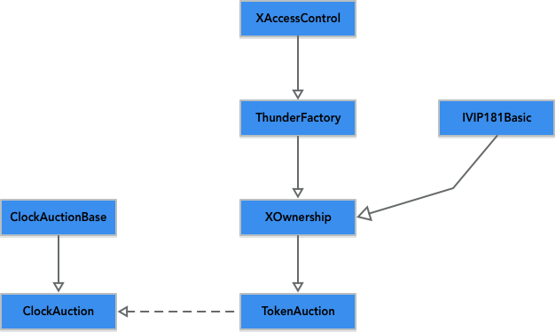
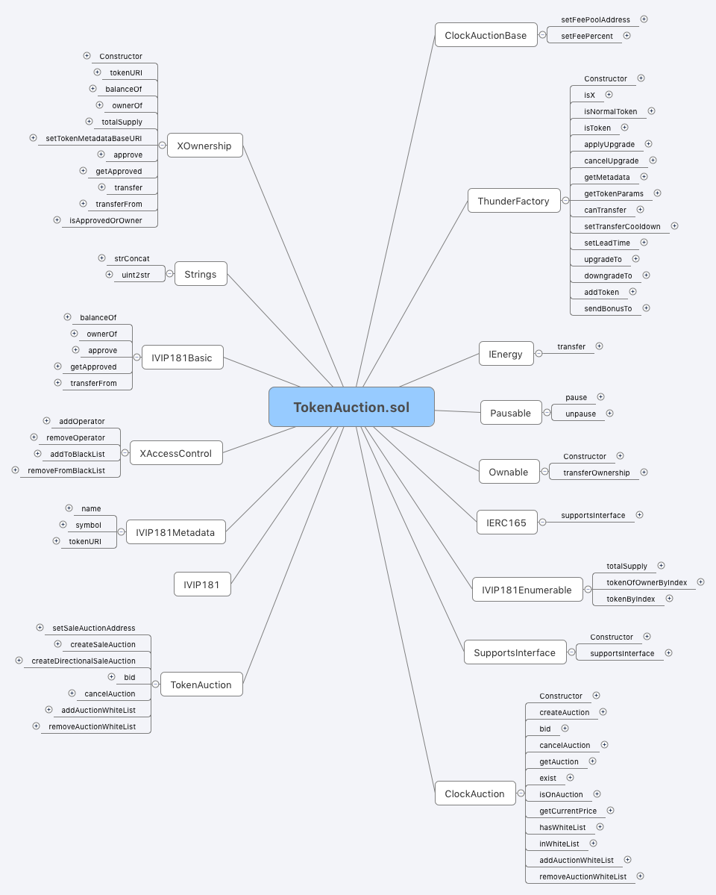
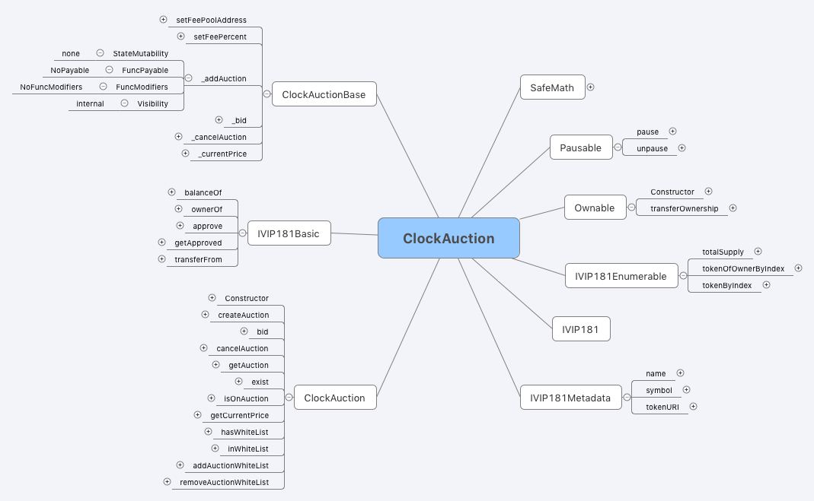

VeChainThor Node Token
====

Contracts for VeChainThor Node Token on the VeChainThor blockchain.

# Table of Contents
- [Project Construct](#project-construct)  
- [Contracts Overview](#contracts-overview)  
        - [TokenAuction.sol](#tokenauctionsol)  
        - [ClockAuction.sol](#clockauctionsol)  
- [Contract Address](#contract-address)  
- [API](#api)  
        - [getMetadata](#getmetadata)  
        - [applyUpgrade](#applyupgrade)  
        - [cancelUpgrade](#cancelupgrade)  
        - [getTokenParams](#gettokenparams)  
        - [idToOwner](#idtoowner)  
        - [ownerToId](#ownertoid)  
        - [createSaleAuction](#createsaleauction)  
        - [createDirectionalSaleAuction](#createdirectionalsaleauction)  
        - [bid](#bid)  
        - [cancelAuction](#cancelauction)  
        - [addAuctionWhiteList](#addauctionwhitelist)  
        - [removeAuctionWhiteList](#removeauctionwhitelist)  
- [Audit Report](#audit-report)  
- [License](#license)  

# Project Construct

The project includes the following files:

        ├── SupportsInterface.sol
        ├── ThunderFactory.sol
        ├── TokenAuction.sol
        ├── XAccessControl.sol
        ├── XOwnership.sol
        ├── auction
        │       ├── ClockAuction.sol
        │       └── ClockAuctionBase.sol
        └── utility
                ├── Ownable.sol
                ├── Pausable.sol
                ├── SafeMath.sol
                ├── Strings.sol
                └── interfaces
                        ├── IERC165.sol
                        ├── IVIP181.sol
                        └── IVIP181Basic.sol

# Contracts Overview

The smart contracts are split into modules.

* [`XAccessControl`](contracts/XAccessControl.sol) - Defines the organizational permission and black lists.
* [`ThunderFactory`](contracts/ThunderFactory.sol) - Defines the `Token` struct and storage, it's the core contract
* [`XOwnership`](contracts/XOwnership.sol) - Implements VIP181 and defines ownership and transfer rights
* [`TokenAuction`](contracts/TokenAuction.sol) - Calls auction contract and Implements token auction
* [`ClockAuction`](contracts/auction/ClockAuction.sol) - Implements token auction logic
* [`ClockAuctionBase`](contracts/auction/ClockAuction.sol) - Defines internal variables, functions for token auction

## TokenAuction.sol

## ClockAuction.sol

# Contract Address

+ TokenAuction: `0xb81E9C5f9644Dec9e5e3Cac86b4461A222072302`
+ ClockAuction: `0xE28cE32d637eb93cBDa105f87FBB829E9ef8540B`

# API

## getMetadata

        function getMetadata(uint256 _tokenId) public view 
                returns(
                        address owner,
                        uint8 level,
                        bool isOnUpgrade,
                        bool isOnAuction,
                        uint64 lastTransferTime,
                        uint64 createdAt,
                        uint64 updatedAt
                )

Get the information about the given token.

Params:

+ _tokenId: token id

Return:

+ owner: the address that owns token
+ level: the level of the token
+ isOnUpgrade: return true when the token is upgrading
+ isOnAuction: return true when the token is on auction
+ lastTransferTime: the timestamp that the token 
+ createdAt: when the token is genearted
+ updatedAt: when the token data is updated

## applyUpgrade

        function applyUpgrade(strengthLevel _toLvl)

Apply for upgrading your node token.

Params:

+ _toLvl: the next level index. Notice that a normal node token cannot upgrade to X node token.

| Level Index | Level Name                  |
| ----------- | --------------------------- |
| 1           | VeChainThor Strength Node   |
| 2           | VeChainThor Thunder Node    |
| 3           | VeChainThor Mjolnir Node    |
| 4           | VeChainThor X Node          |
| 5           | VeChainThor Strength X Node |
| 6           | VeChainThor Thunder X Node  |
| 7           | VeChainThor Mjolnir X Node  |

## cancelUpgrade

        function cancelUpgrade(uint256 _tokenId)

Cancel the application of upgrading node token.

Params:

+ _tokenId: the id of the token

## getTokenParams

        function getTokenParams(strengthLevel _level) public view
                returns(
                        uint256 minBalance,
                        uint64 ripeDays,
                        uint64 rewardRatio,
                        uint64 rewardRatioX
                )

Get Node Level parameters

Return:

+ minBalance: the minimum VET balance needed
+ ripeDays: the days of being the level
+ rewardRatio: reward ratio for normal node token
+ rewardRatioX: reward ratio for X node token

## idToOwner

        function idToOwner(uint256 _tokenId) public view
                returns (address)

Get the owner of the given node token.

Params:

+ _tokenId: the id of node token

Return: the owner of the token

## ownerToId

        function ownerToId(address _owner) public view
                returns (uint256)

Get the node token id of the given address owns.

Params:

+ _owner: the address that owns token

Return: the node token id of the given address owns

## createSaleAuction

        function createSaleAuction(
                uint256 _tokenId,
                uint128 _startingPrice,
                uint128 _endingPrice,
                uint64 _duration
        ) public

Create an public auction.

Params:

+ _tokenId: the id of token
+ _startingPrice: starting price
+ _endingPrice: ending price
+ _duration: the duration of the auction from 2 hours to 7 days

## createDirectionalSaleAuction

        function createDirectionalSaleAuction(
                uint256 _tokenId,
                uint128 _price,
                uint64 _duration,
                address _toAddress
        ) public

Create a directional auction.

Params:

+ _tokenId: the id of token
+ _price: the selling price
+ _duration: the duration of the auction from 2 hours to 7 days
+ _toAddress: the receiver address
  

## bid

        function bid(uint256 _tokenId) public payable

Purchase or bid an auction.

Params:

+ _tokenId: the id of token

## cancelAuction

        function cancelAuction(uint256 _tokenId) public

Cancel the auction.

Params:

+ _tokenId: the id of token

## addAuctionWhiteList

        function addAuctionWhiteList(uint256 _tokenId, address _address) public

Add an address to whitelist.

Params:

+ _tokenId: the id of token
+ _address: the target address

## removeAuctionWhiteList

        function removeAuctionWhiteList(uint256 _tokenId, address _address) public

Remove an address from whitelist.

Params:

+ _tokenId: the id of token
+ _address: the target address

# Audit Report

Security audit performed by [SlowMist Team](https://github.com/slowmist/Knowledge-Base/tree/master/open-report/VeChainThorNodeToken-Smart-Contract-Security-Audit-Report.md).

# License

It is licensed under the [GNU Lesser General Public License v3.0](https://www.gnu.org/licenses/lgpl-3.0.html), also included in [LICENSE](LICENSE) file in repository.

